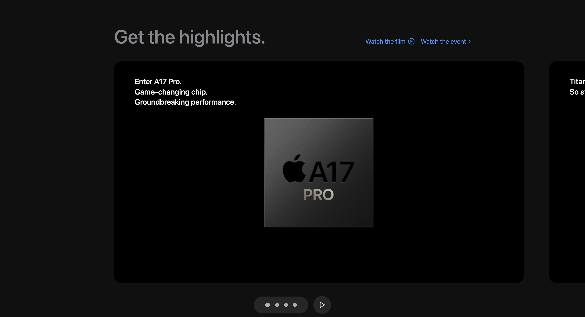

# Apple Website Clone

## Landing Page


## Scrolling Down 


This project is a high-fidelity clone of the Apple website, designed to replicate its look and feel while incorporating modern web technologies for learning and demonstration purposes.

## Technologies Used
- **React**: A JavaScript library for building user interfaces, enabling dynamic and responsive web pages.
- **TypeScript**: A typed superset of JavaScript that compiles to plain JavaScript, used for its robust typing system.
- **Tailwind CSS**: A utility-first CSS framework for rapidly building custom designs, utilized for styling and responsive layouts.
- **Vim**: An efficient text editor used for coding and editing project files.
- **Three.js**: A cross-browser JavaScript library/API used to create and display animated 3D computer graphics in a web browser.
- **GSAP (GreenSock Animation Platform)**: A JavaScript library for building high-performance animations, used to enhance the interactivity and visual appeal of the website.

## Features
- **Responsive Design**: Ensures that the website is accessible and functional on devices of all sizes.
- **Advanced Animations**: Leveraging GSAP for smooth and engaging visual effects.
- **3D Elements**: Utilizing Three.js to add interactive 3D models to the website, enhancing the user experience.

## Getting Started
To get a local copy up and running, follow these simple steps.

### Prerequisites
- **npm**
  ```sh
  npm install npm@latest -g

  npm start


## What I've Learned

### Front-End Development
- **React & TypeScript Integration**: I deepened my understanding of how to effectively use TypeScript with React to create type-safe and scalable applications. This combination allows for better code maintainability and error checking during development.
- **Component-Based Architecture**: I gained experience in structuring a project using reusable components, which promotes cleaner code and easier management of the user interface.
- **Tailwind CSS for Responsive Design**: Using Tailwind CSS has taught me how to quickly prototype and build responsive layouts with utility-first CSS classes, which significantly speeds up the styling process.

### Advanced Animations and 3D Graphics
- **GSAP for High-Performance Animations**: Implementing GSAP allowed me to create smooth, performant animations that enhance the user experience without compromising on performance. I learned how to synchronize animations and create complex sequences.
- **Three.js for 3D Elements**: Working with Three.js introduced me to the world of 3D graphics on the web. I learned how to create and manipulate 3D models, handle camera perspectives, and add interactivity to 3D elements.

### Tools and Workflow
- **Vim for Efficient Coding**: Using Vim improved my coding efficiency through powerful keyboard shortcuts and commands, leading to a faster development process.
- **Project Setup and Management with npm**: Setting up and managing the project dependencies with npm taught me how to handle package installations, version control, and script automation for building and deploying the application.

### Problem-Solving and Debugging
- **Debugging TypeScript and React Applications**: Encountering and resolving various issues with TypeScript and React provided valuable experience in debugging and problem-solving within these environments.
- **Optimizing Performance**: I learned techniques for optimizing the performance of a web application, especially when dealing with complex animations and 3D graphics, ensuring a smooth user experience across different devices.

By completing this project, I have significantly enhanced my skills in modern web development, from building responsive and dynamic interfaces to creating engaging animations and interactive 3D graphics. This project has been a comprehensive learning experience that has prepared me for more advanced development challenges.

