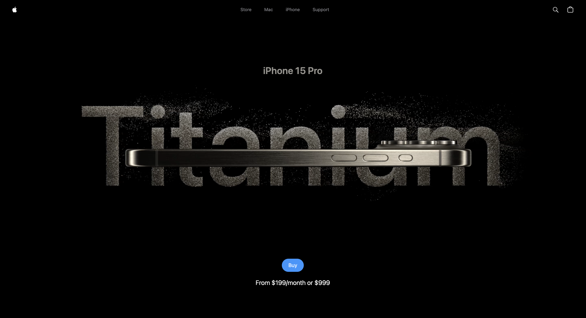

# Apple Website Clone

## Landing Page


## Scrolling Down 


This project is a high-fidelity clone of the Apple website, designed to replicate its look and feel while incorporating modern web technologies for learning and demonstration purposes.

## Technologies Used
- **React**: A JavaScript library for building user interfaces, enabling dynamic and responsive web pages.
- **TypeScript**: A typed superset of JavaScript that compiles to plain JavaScript, used for its robust typing system.
- **Tailwind CSS**: A utility-first CSS framework for rapidly building custom designs, utilized for styling and responsive layouts.
- **Vim**: An efficient text editor used for coding and editing project files.
- **Three.js**: A cross-browser JavaScript library/API used to create and display animated 3D computer graphics in a web browser.
- **GSAP (GreenSock Animation Platform)**: A JavaScript library for building high-performance animations, used to enhance the interactivity and visual appeal of the website.

## Features
- **Responsive Design**: Ensures that the website is accessible and functional on devices of all sizes.
- **Advanced Animations**: Leveraging GSAP for smooth and engaging visual effects.
- **3D Elements**: Utilizing Three.js to add interactive 3D models to the website, enhancing the user experience.

## Getting Started
To get a local copy up and running, follow these simple steps.

### Prerequisites
- **npm**
  ```sh
  npm install npm@latest -g
